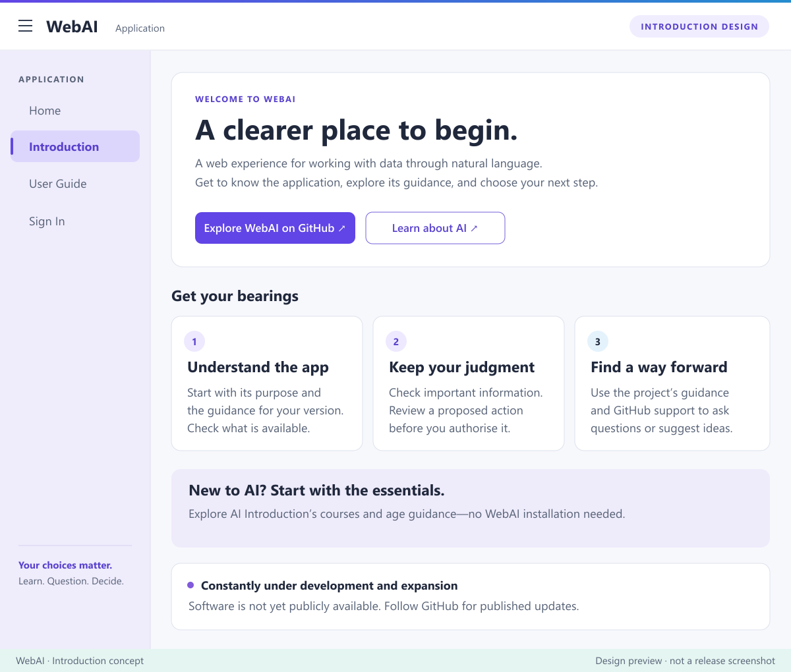

# Green Web Land

[WebAI](https://github.com/Green-Web-Land/WebAI) · [AI Introduction](https://github.com/Green-Web-Land/AI-Introduction) · [Essential Knowledge for Life](https://github.com/Green-Web-Land/Essential-for-Life) · [About and contact](#about-and-contact)

Welcome to Green Web Land—a home for WebAI and practical learning materials.

## WebAI

A web experience for working with data through natural language. WebAI is constantly under development and expansion. Software is not yet publicly available.

[Explore the public introduction](https://github.com/Green-Web-Land/WebAI). Help and software availability will be described in the project as they are published.

## AI Introduction

**Learn to use AI well—and remain able to think, choose and act for yourself.**

Read about what AI can do, its limitations, checking information, privacy, responsible choices and possible futures.

Available courses:
- [Adult beginners](https://github.com/Green-Web-Land/AI-Introduction/blob/main/courses/adults/CURRICULUM.md)
- [Kids, ages 9–12](https://github.com/Green-Web-Land/AI-Introduction/blob/main/courses/kids/CURRICULUM.md)
- [Teenagers, ages 13–17](https://github.com/Green-Web-Land/AI-Introduction/blob/main/courses/teenagers/CURRICULUM.md)

Start with the [course catalogue and age guidance](https://github.com/Green-Web-Land/AI-Introduction). You can read the materials without installing WebAI or creating an AI account.

For free reuse, including commercial reuse and adaptation, follow the [educational content's CC BY 4.0 terms and exceptions](https://github.com/Green-Web-Land/AI-Introduction/blob/main/LICENSE.md). These educational terms do not license WebAI software.

## Essential Knowledge for Life

**Planned—courses are not yet published.**

Practical learning about everyday technology, money, family, work, science, our planet, space and personal care. [Explore the series and its planned topics](https://github.com/Green-Web-Land/Essential-for-Life).

## About and contact

These projects are maintained by **Massoud Fattahi, Canada**.

For general questions and suggestions, please use the relevant project's GitHub Issues when enabled. We prefer GitHub for public discussion so useful answers can help others.

For private enquiries, email [us@itisthebest.com](mailto:us@itisthebest.com). Do not post passwords, private correspondence or sensitive personal information in public issues. Send logs or attachments only when support specifically requests them.

## A look at WebAI

*Introduction page design inspired by the historical Basic UI baseline. This is a design preview, not a screenshot of the current release. Software is not yet publicly available.*

